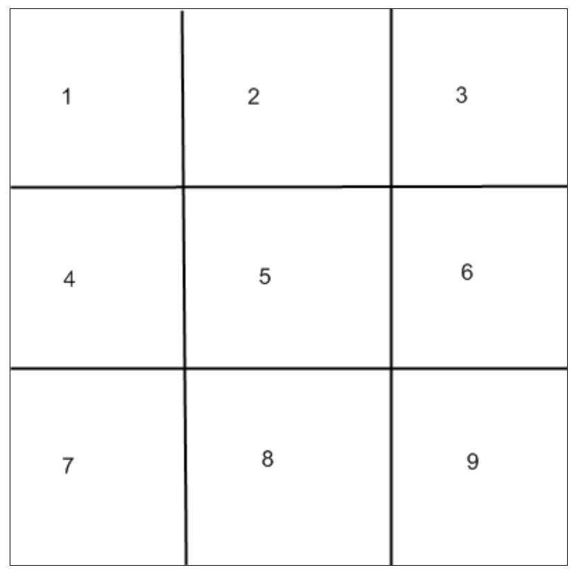
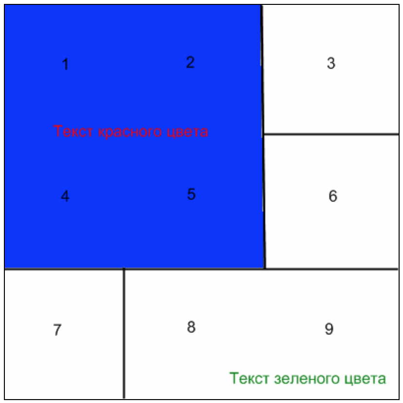

# TestJob-HtmlGrid
One of test jobs offered to me

Developer: [Alexander Letnikow](mailto:reclamme@gmail.com)

I was offered to do a little function. This function must generated GRID system using HTML (div or tables, but not images).
###Input
On input for this function I had PHP array of arrays:
```php
<?php
[
    [
        'text' => 'Some text',
        'cells' => 'Number of cells',
        'align' => 'Horizontal align',
        'valigh' => 'Vertical aligh',
        'color' => "Text color",
        'bgcolor' => 'Background color',
    ],
    //...
];
```
Where numbers of cells is set of numbers from 0 to 9. This numbers identify cell in grid



###Output
Result of the work of function must be valid HTML page with grid, in which text must have color, position, align from PHP array

####Example
For example, array:
```php
<?php
[
  [
      'text' => 'Текст красного цвета',
      'cells' => '1,2,4,5',
      'align' => 'center',
      'valign' => 'center',
      'color' => 'FF0000',
      'bgcolor' => '0000FF',
  ],
  [
      'text' => 'Текст зеленого цвета',
      'cells' => '8,9',
      'align' => 'right',
      'valign' => 'bottom',
      'color' => '00FF00',
      'bgcolor' => 'FFFFFF',
  ]
];
```
Will be converted to HTML page like:



> The resulting page must not contain any images. Everything must be implemented only by table / div elements and CSS styles.